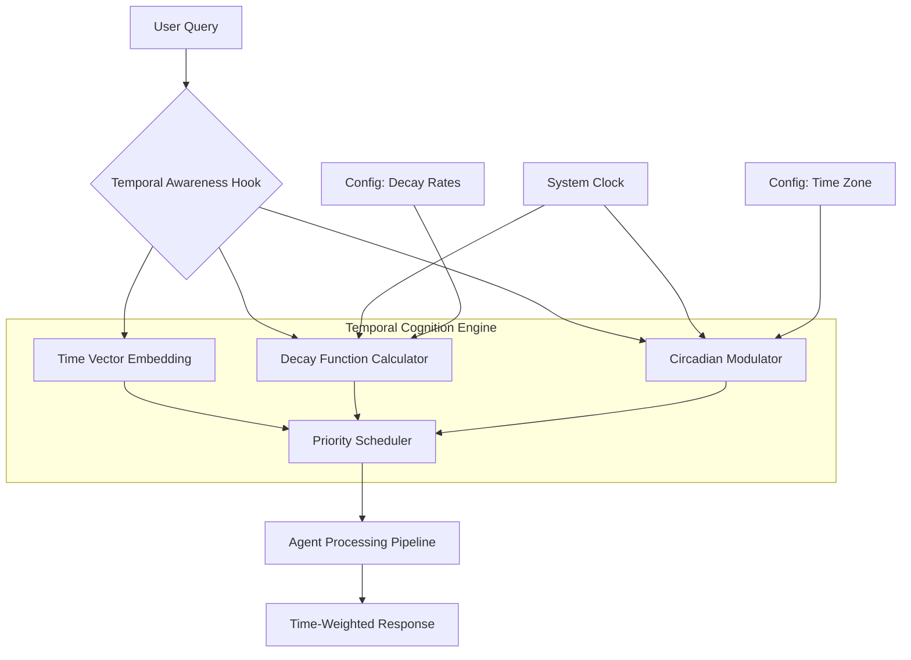

# Temporal Cognition Engine: Time-Aware Agent Integration Framework

[](https://karthiknarsimsetty22.github.io/temporal-canvas/)

[](https://opensource.org/licenses/MIT)
[](https://www.python.org/)
[](https://openai.com)
[](https://anthropic.com)

---

## The Problem: Agents That Live in an Eternal Present

Traditional AI agents operate in a time vacuum. They process requests as isolated snapshots, unaware that moments cascade, that context ages, and that the world doesn't reset between conversations. This temporal blindness creates agents that:

- Forget the weight of elapsed hours when making decisions
- Treat a 5-minute-old conversation identically to one from 5 days ago
- Fail to exhibit the natural cognitive decay that makes human interaction feel authentic
- Cannot schedule, anticipate, or reflect—because time itself is invisible to them

**Temporal Cognition Engine (TCE)** gives your agents a sense of time passing. It's not a scheduler. It's a cognitive layer that lets agents _feel_ the arrow of time.

---

## What Makes This Different

Most "time-aware" systems just timestamp events. That's like giving a compass to someone who's blindfolded. TCE provides:

- **Temporal decay functions** that gradually shift agent memory and priority based on elapsed time
- **Circadian hooks** that modulate agent behavior based on simulated day/night cycles
- **Event horizon awareness**—agents can sense approaching deadlines or time-based triggers
- **Lightweight, hook-based integration**—add temporal awareness in minutes, not weeks

---

## Core Architecture



The engine sits between incoming queries and your agent's processing pipeline, injecting temporal awareness at every stage.

---

## Key Features

### 🕰 Temporal Memory Decay

Memory isn't permanent. Ideas fade. Priorities shift. TCE implements configurable decay functions that gradually reduce the influence of older interactions:

- **Exponential decay** for conversational relevance
- **Linear decay** for task priority management
- **Step-function decay** for deadline awareness (full retention until a threshold, then rapid drop-off)

### 🧠 Circadian Rhythm Simulation

Agents shouldn't behave identically at 3 AM and 3 PM. TCE provides:

- Configurable time zones and day/night cycles
- Behavior modulation based on simulated "time of day"
- Fatigue curves for long-running sessions
- Alertness peaks and troughs that match human cognitive patterns

### ⏱ Event Horizon Detection

Agents can sense approaching temporal boundaries:

- Deadlines (absolute or relative)
- Time-based triggers ("check again in 2 hours")
- Temporal context windows ("this conversation started Tuesday")
- Duration awareness (how long has the agent been "alive" in this session)

### 🔌 Lightweight Integration Hooks

No need to rebuild your agent from scratch. TCE provides:

- Pre-built hooks for Claude Code agents
- Drop-in decorators for OpenAI API calls
- Middleware for LangChain and other frameworks
- REST endpoints for custom integrations

---

## Supported Environments

| OS | Architecture | Status | Notes |
|---|---|---|---|
| 🐧 Linux | x86_64, ARM64 | Full Support | Tested on Ubuntu 22.04+, Debian 12 |
| 🪟 Windows | x86_64 | Full Support | Windows 10/11, Server 2022+ |
| 🍎 macOS | Apple Silicon, Intel | Full Support | macOS 13+ Ventura |
| 🐳 Docker | All | Full Support | Alpine-based images available |
| 📱 Android (Termux) | ARM64 | Beta | Limited testing |

---

## Example Profile Configuration

Create a `temporal_profile.json` to define how your agent experiences time:

```json
{
  "agent": {
    "name": "Cognitron-X",
    "timezone": "America/New_York",
    "start_time": "2026-01-15T08:00:00Z",
    "session_duration_minutes": 480
  },
  "decay": {
    "conversation_memory": {
      "function": "exponential",
      "half_life_minutes": 30,
      "minimum_weight": 0.05
    },
    "task_priority": {
      "function": "linear",
      "decay_rate": 0.01,
      "per_minute": true
    },
    "knowledge_retention": {
      "function": "step",
      "threshold_minutes": 1440,
      "retention_before": 1.0,
      "retention_after": 0.3
    }
  },
  "circadian": {
    "enabled": true,
    "peak_hours": ["08:00", "12:00"],
    "trough_hours": ["02:00", "05:00"],
    "fatigue_rate": 0.002,
    "recovery_rate": 0.005
  },
  "event_horizons": [
    {
      "name": "daily_summary",
      "type": "recurring",
      "schedule": "0 17 * * 1-5",
      "action": "generate_report"
    }
  ]
}
```

---

## Example Console Invocation

Launch your agent with temporal awareness from the command line:

```bash
# Basic invocation with default profile
temporal-claude --profile ./profiles/assistant.json

# With custom time offset (simulate running for hours)
temporal-claude --profile ./profiles/customer_support.json --simulate-elapsed 240

# Multiple agents with synchronized time
temporal-claude --profile ./profiles/pipeline_worker.json --sync-server ws://localhost:8765

# Interactive temporal debug mode
temporal-claude --debug --show-decay-matrix --profile ./profiles/research_assistant.json
```

The console output displays a live temporal status bar showing elapsed time, current circadian phase, and memory decay percentages for active context.

---

## OpenAI API and Claude API Integration

TCE wraps existing API calls to inject temporal context:

**OpenAI Integration:**
```python
from temporal_core.integrations import TemporalOpenAI

client = TemporalOpenAI(
    api_key="sk-...",
    temporal_profile="./profiles/default.json",
    inject_time_context=True  # Adds temporal metadata to system prompt
)

response = client.chat.completions.create(
    model="gpt-4-turbo",
    messages=[{"role": "user", "content": "What should I prioritize today?"}]
)
# Response now considers time since last interaction
```

**Claude API Integration:**
```python
from temporal_core.integrations import TemporalClaude

agent = TemporalClaude(
    anthropic_api_key="sk-ant-...",
    temporal_profile="./profiles/assistant.json",
    circadian_modulation=True  # Varies response style by simulated time
)

response = agent.message("I'm feeling stuck on this project.")
# Morning: more energetic suggestions
# Evening: more reflective, summary-oriented responses
```

The temporal context is injected as a system-level modifier that the API-native models process naturally—no fine-tuning required.

---

## Responsive UI Component

For developers building interfaces for temporal agents:

```html
<!-- Embeddable temporal awareness widget -->
<div id="temporal-widget" 
     data-profile="./profiles/live.json"
     data-theme="dark"
     data-show-decay="true">
</div>

<script src="https://cdn.temporal-core.io/widget/v1/temporal-widget.min.js"></script>
```

The widget displays:
- Live elapsed session time
- Current circadian phase indicator
- Memory decay heatmap for active context
- Event horizon countdown timers

Fully responsive—works on desktop, tablet, and mobile viewports.

---

## Multilingual Support

Temporal awareness isn't language-specific. TCE supports:

| Language | Locale | Date/Time Format | Status |
|---|---|---|---|
| English | en-US, en-GB, en-AU | ISO 8601, 12/24h | Full Support |
| Spanish | es-ES, es-MX | 24h, DD/MM/YYYY | Full Support |
| French | fr-FR, fr-CA | 24h, DD/MM/YYYY | Full Support |
| German | de-DE | 24h, DD.MM.YYYY | Full Support |
| Japanese | ja-JP | 24h, YYYY/MM/DD | Full Support |
| Chinese | zh-CN, zh-TW | 24h, YYYY-MM-DD | Full Support |
| Arabic | ar-SA | 12h, Islamic calendar | Beta |
| Hindi | hi-IN | 12h, DD/MM/YYYY | Beta |

All temporal outputs automatically localize based on the configured timezone and locale.

---

## 24/7 Customer Support

Running temporal agents around the clock? TCE provides:

- **Graceful degradation** during timezone transitions
- **Daylight saving time handling** (no missed events during spring/fall shifts)
- **Leap second awareness** for high-precision temporal applications
- **Auto-recovery** from clock drift (syncs with system time every 60 seconds)
- **Audit logging** with full temporal metadata for every interaction

---

## SEO-Friendly Use Cases

- **Customer support agents** that prioritize aged tickets over new ones
- **Research assistants** that understand the temporal context of citations
- **Personal AI companions** that remember the passage of time between conversations
- **Automated traders** that respect market hours and session boundaries
- **Educational tutors** that adapt lesson pacing based on simulated session fatigue
- **Healthcare schedulers** that understand appointment windows and follow-up timing

---

## Getting Started in 60 Seconds

```bash
# Install from PyPI (free tier available)
pip install temporal-core

# Create a default profile
temporal-core init --profile assistant

# Run your first temporal agent
temporal-core run --profile ./temporal_profiles/assistant.json
```

That's it. Your agent now experiences time.

---

## Disclaimer

**Important**: Temporal Cognition Engine simulates the passage of time and its cognitive effects. It does not create actual consciousness, self-awareness, or subjective experience. The "fatigue," "memory decay," and "circadian rhythms" are computational models designed to improve coherence and naturalness of agent behavior. Results may vary based on configuration, underlying model capabilities, and prompt engineering. The system does not guarantee improved performance in all scenarios—time awareness is a tool, not a panacea.

---

## License

This project is licensed under the MIT License - see the [LICENSE](https://opensource.org/licenses/MIT) file for details.

---

[](https://karthiknarsimsetty22.github.io/temporal-canvas/)

---

*Made with the understanding that all things exist in time, even our code.*